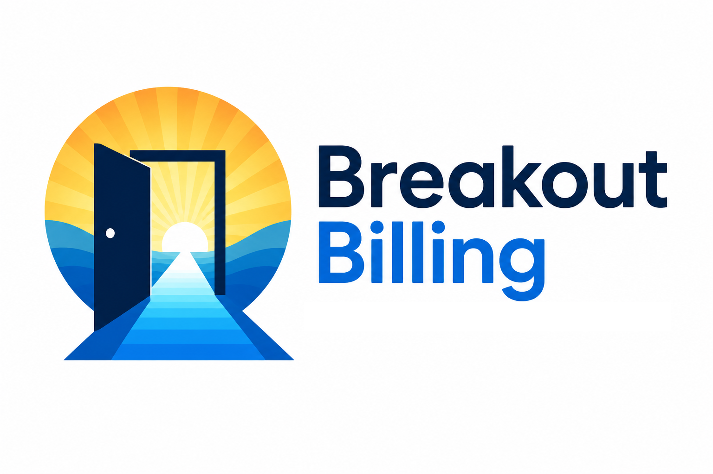
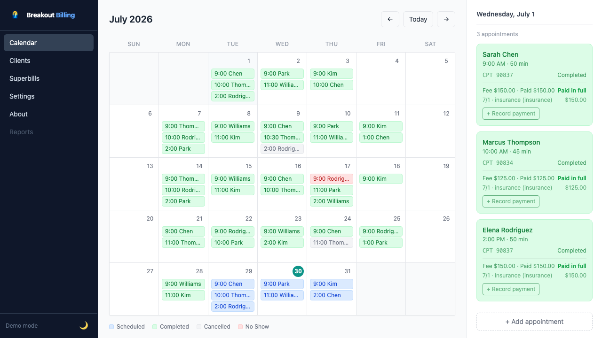
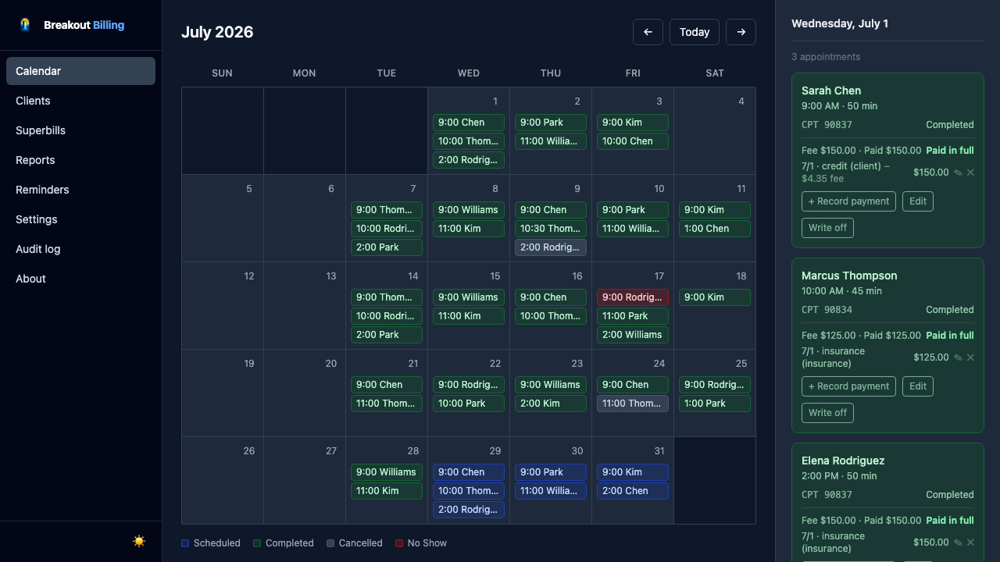
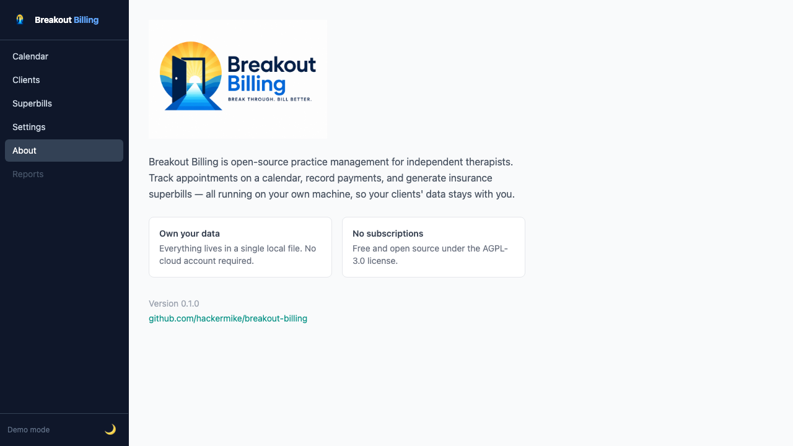

<p align="center">
  
</p>

<p align="center">
  Open-source practice management for independent therapists.<br/>
  Own your data. Run it on your laptop. No subscriptions.
</p>

---

**Who it's for:** a solo private-practice therapist who bills clients directly
(self-pay / out-of-network) and hands them **superbills** to submit for
reimbursement. It intentionally does **not** file insurance claims, host video
visits, or offer a client portal — that's a much larger, separate undertaking
(see [CLARIFICATIONS.md](CLARIFICATIONS.md#decided-scope-2026-07-30)). This is the
tool one therapist can run on their own laptop.



## What it does

- **Calendar** — month view of appointments, color-coded by status. Click a day to see details, book new appointments inline (they appear live, no page reload), and record payments.
- **Clients** — add clients with demographics, insurance info, and ICD-10 diagnosis codes; each client has a detail page with appointment history, running balance, and one-click superbill generation.
- **Import** — bring your client list over from SimplePractice, TherapyNotes, TheraNest, or any spreadsheet; columns are matched automatically. See [docs/IMPORT.md](docs/IMPORT.md).
- **Payments** — record payments against any appointment; balances and paid-in-full status update automatically.
- **Edit & reschedule** — change any appointment, move it to another day (calendar chips update live), or delete it.
- **Recurring appointments** — book a standing slot every N weeks or N months for up to 52 sessions in one go, and edit or cancel *this and all future* occurrences as a group.
- **Superbills** — generate a professional PDF a client submits to their insurer for out-of-network reimbursement, with your NPI, CPT/ICD-10 codes, fees, and payments.
- **Reports** — income by month, income by payer, and outstanding balances (accounts receivable).
- **Email reminders** — opt clients in per person; a "Reminders due" panel sends the next couple of days' appointment reminders (preview-only until you configure SMTP — nothing is delivered and reminders stay due, so none are lost). Setup guide: [docs/EMAIL-SETUP.md](docs/EMAIL-SETUP.md).
- **Settings** — store your provider details (NPI, credentials, tax ID) once; they flow onto every superbill.
- **Light & dark mode**, and everything runs on your own machine.

Want the full tour with realistic data in one command? Run `./scripts/demo.sh`
(see [demo/README.md](demo/README.md)).

Coming next: SMS reminders (Phase 2 of [docs/NOTIFICATIONS-PLAN.md](docs/NOTIFICATIONS-PLAN.md)) and the insurance workflows in [CLARIFICATIONS.md](CLARIFICATIONS.md).

<p align="center">
  
  
</p>

See [docs/USAGE.md](docs/USAGE.md) for a full walkthrough.

## Quick start (Mac)

**Requirements:** Python 3.9 or newer. Check by opening Terminal (press `Cmd+Space`, type "Terminal") and running `python3 --version`. If you don't have it, download from [python.org/downloads](https://www.python.org/downloads/).

**Option A — Download (no tools needed)**

1. On this page, click the green **Code** button → **Download ZIP**.
2. Double-click the downloaded file to unzip it.
3. In Terminal, drag the unzipped folder onto the window after typing `cd ` (note the space), then press Enter.
4. Run `./start.sh`.

**Option B — Clone with git** (if you have git installed)

```bash
git clone https://github.com/hackermike/breakout-billing.git
cd breakout-billing
./start.sh
```

Either way, your browser will open to `http://localhost:8000` with demo data loaded. Press `Ctrl+C` in the terminal to stop.

That's it. No accounts, no cloud, no subscriptions.

## Running again later

```bash
cd breakout-billing
./start.sh
```

The demo data is only created on the first run. Your real data lives in `breakout.db` in the project folder.

## Backing up your data

All your data is a single file, `breakout.db` — backing it up is just copying that file somewhere safe. A helper script does this safely (even while the app is running):

```bash
./scripts/backup.sh
```

This writes a timestamped copy to `backups/` and keeps the 30 most recent. See [docs/BACKUP.md](docs/BACKUP.md) for a recommended routine (encrypted external drive + periodic offsite copy) and how to restore.

## HIPAA

On first launch you'll set a **password** — it protects the app on your machine, so a lost or borrowed laptop doesn't hand over client data.

Running locally means your data never leaves your computer. Turn on FileVault disk encryption (`System Settings → Privacy & Security → FileVault`) to satisfy the HIPAA encryption-at-rest requirement for a solo practice. Keep backups encrypted too — see [docs/BACKUP.md](docs/BACKUP.md). Security posture and boundaries: [docs/SECURITY.md](docs/SECURITY.md).

## For developers

```bash
python3 -m venv .venv
.venv/bin/pip install -r requirements-dev.txt
.venv/bin/python seed.py          # demo data
.venv/bin/uvicorn app.main:app --reload

.venv/bin/pytest -q               # unit + integration tests
.venv/bin/ruff check .            # lint
bash scripts/smoke.sh             # end-to-end smoke test
```

See [docs/ARCHITECTURE.md](docs/ARCHITECTURE.md) for how the code is laid out and [CONTRIBUTING.md](CONTRIBUTING.md) to get started. Optional pre-commit hooks: `.venv/bin/pip install pre-commit && pre-commit install`.

## Contributing

Pull requests welcome. This project is in early development — see [CONTRIBUTING.md](CONTRIBUTING.md) and open issues for what's needed next.

## License

[AGPL-3.0](LICENSE). You're free to use, modify, and self-host this software. If you run a modified version as a network service, you must make your source available under the same license. For commercial licensing options, open an issue.
